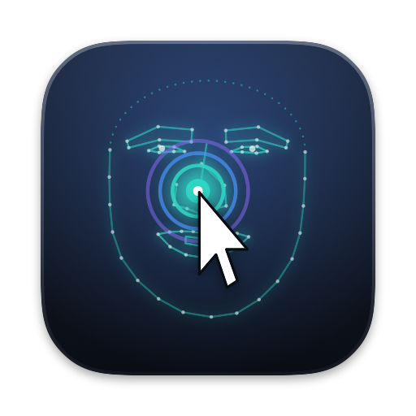
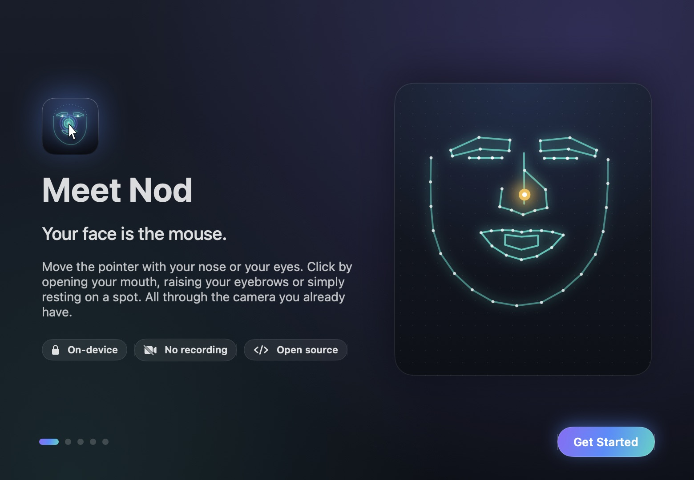
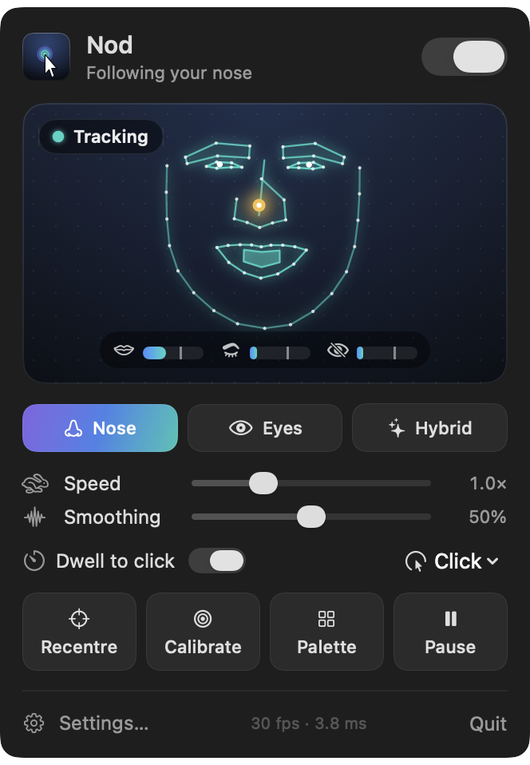
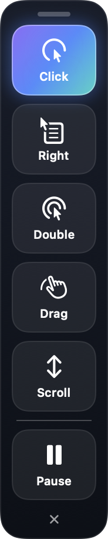
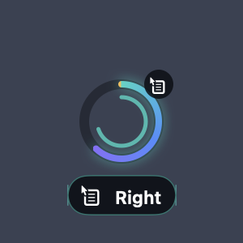
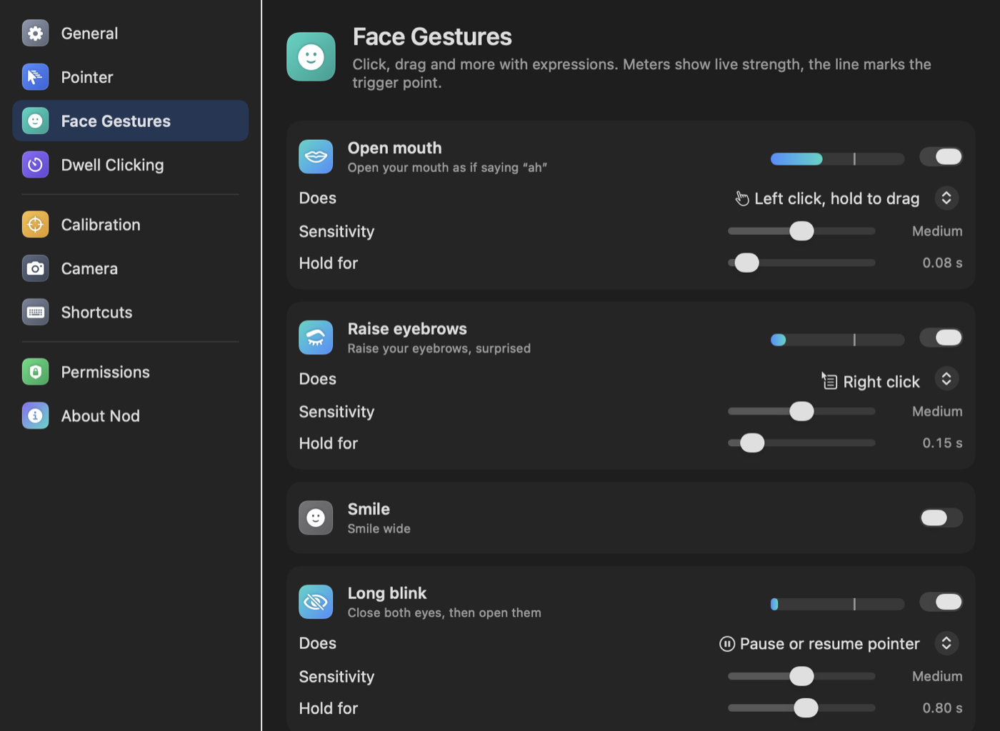
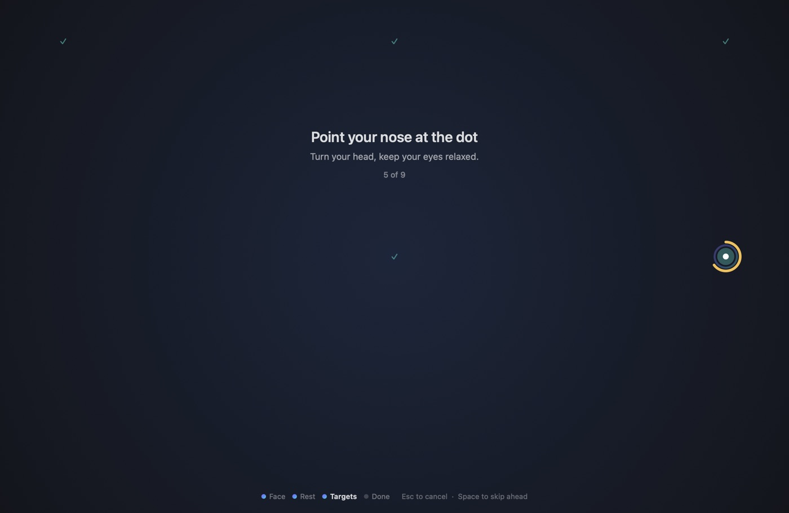

<p align="center">
  
</p>

<h1 align="center">Nod</h1>
<p align="center"><b>Your face is the mouse.</b><br>
Hands-free pointer control for macOS, through the camera you already have.</p>

<p align="center">
  
</p>

Nod follows your nose (or your eyes, or your AirPods) to move the pointer, and turns expressions into clicks.
Open your mouth to click, keep it open to drag, raise your eyebrows to right click, or simply
rest on a spot. It lives in the menu bar, runs entirely on your Mac and is free and open source.

It is built for people who cannot use a mouse or trackpad comfortably, whether because of a
disability, an injury or RSI, and for anyone who wants their hands free.

## What it does

**Four ways to steer**

- **Nose** (recommended). Relative motion that feels like a mouse, direct aiming where your nose
  points at a spot on screen, or a joystick that glides while you tilt away from centre.
- **Eyes** (experimental). Look where you want to go. Webcam gaze is coarse, so it is honest about that.
- **Hybrid**. Your eyes jump the pointer to the right area, your nose places it exactly.
- **AirPods**. Turn your head with AirPods in. The camera stays off: AirPods with head tracking
  for spatial audio measure the head's orientation themselves, so Nod only turns a few numbers
  a second into pointer movement. No calibration, just Recentre.

**Clicking with your face.** Six expressions, each mapped to any action you choose, with a live
meter that shows how strong the expression is and where it triggers.

| Expression | Default | Can also do |
| --- | --- | --- |
| Open mouth | Left click, hold to drag | Any click, drag, scroll mode, pause, recentre, palette |
| Raise eyebrows | Right click | |
| Long blink | Pause or resume | |
| Smile, left wink, right wink | Off | |

While an expression forms, Nod holds the pointer steady so the click lands where you aimed.

With AirPods, leaning your head sideways clicks, because leaning does not steer:

| Head movement | Default |
| --- | --- |
| Lean left | Left click, hold to drag |
| Lean right | Right click |
| Nod | Off (double click), since glancing at the keyboard looks similar |

A nod clicks where the pointer was before your head went down.

**Dwell clicking.** Rest the pointer and a ring fills, then clicks. A floating palette of big
targets picks what the next dwell does: right click, double click, drag, scroll or pause. You can
dwell on the palette itself, so no gesture is ever required.

**Guided calibration.** Nine targets, about twenty seconds, fully hands-free. Every step advances
on its own once your face is steady, and Nod learns your range of movement and, optionally, how
strongly you make each expression.

**The rest.** Scroll mode (tilt to scroll), pause, recentre, multi-display support, global
shortcuts, launch at login, and it steps aside the moment a helper touches the real mouse.

<p align="center">
  
  &nbsp;
  
  &nbsp;
  
</p>

<p align="center">
  
</p>

<p align="center">
  
</p>

## Private by design

- Video is analysed in memory and dropped. Nothing is recorded, stored or sent.
- Nod makes no network connections. No account, no analytics.
- Only your settings and calibration numbers are saved. The camera is on only while Nod is
  tracking or showing a preview.

## Light on your Mac

Measured on a MacBook Pro (Apple M5) with the built-in camera:

| State | CPU |
| --- | --- |
| Camera tracking, Balanced (24 fps) | about 21% of one core, plus the system camera service |
| AirPods, waiting for them | 0.3% of one core |
| Tracking off | 0% |

The camera is the expensive part whatever reads it: macOS's own camera service costs CPU
before any face analysis starts. The AirPods input avoids both.

Full face detection, the expensive step, runs a few times per second; in between Nod carries the
face box along with the landmarks. When nobody is in front of the camera it looks at a third of
the frames. Battery mode drops to 15 fps; Precision uses 720p at 30 fps for eye tracking.

## Install

Nod needs macOS 14 Sonoma or later. Build it from source (a signed download will follow):

```bash
git clone https://github.com/ydisli/nod.git
cd nod
make app
open build/Nod.app
```

You need the Xcode command line tools with Swift 6 (`xcode-select --install`). `make install`
copies the app to `/Applications`.

On first launch a short tour asks for two permissions:

- **Camera**, to see your face.
- **Accessibility**, to move the pointer and click. macOS silently ignores the events without it.

Locally built apps are signed ad hoc, so macOS asks for Accessibility again after every new
build. That is expected. Set `SIGN_IDENTITY` to a real certificate to avoid it.

## Using it

| Shortcut | Does |
| --- | --- |
| ⌃⌥N | Start or stop Nod, your safety switch |
| ⌃⌥C | Recentre the pointer |
| ⌃⌥K | Calibrate |

All three can be changed or cleared in Settings, Shortcuts. Right click the menu bar icon for a
quick menu.

For the best tracking, light your face from the front, put the camera at eye level about an arm's
length away, and calibrate sitting the way you normally will.

## How it works

```
camera (native 420v, 640×480)
  → Vision face detection, every few frames
  → Vision landmarks on the carried face box, every frame (76 points)
  → iris refinement: the darkest pixels inside each eye outline
  → FaceGeometry: scale and roll invariant features (nose, head angle, gaze, expressions)
  → 1€ filter: steady when still, no lag when moving
  → PointerEngine: relative / direct / joystick / eyes / hybrid, gestures, dwell, scroll
  → CGEvent mouse events, glided at 60 Hz
```

All the maths lives in `NodCore`, a dependency-free Swift module with unit tests: the filters,
the ridge regression behind calibration, the gesture and dwell state machines, the pupil locator
and the pointer engine itself. The app target adds the camera, Vision, event posting and SwiftUI.

```
Sources/NodCore     tracking maths, fully tested
Sources/Nod         menu bar app (camera, Vision, UI)
Tests/NodCoreTests  Swift Testing suite
Support             Info.plist, entitlements, icon
scripts             build and developer tools
```

## Development

```bash
make test                     # unit tests
make run                      # build and launch
make icon                     # re-render the icon from the NodMark SwiftUI view
.build/debug/Nod --diagnose-image face.jpg     # run the tracker on a photo
.build/debug/Nod --render-screens /tmp/shots   # render every screen with demo data
```

Launch with `open --env NOD_DEV=1 build/Nod.app` and `scripts/devctl.swift` can open screens,
toggle tracking, print live stats (`status`) and capture Nod's own windows (`snapshot DIR`).

Each calibration also writes its raw numbers (landmark-derived only, never images) to
`~/Library/Application Support/Nod/last-calibration-v1.json`. Attaching that file to an issue is
the fastest way to get tracking problems fixed.

## Honest limits

- Webcam eye tracking is coarse: expect the pointer to land near small targets, not on them.
  Hybrid mode exists for exactly that.
- Strong backlight, very dim rooms and bright reflections on glasses make tracking worse.
- Expression thresholds differ from face to face. The Teach step in calibration tunes them to yours.

## Contributing

Issues and pull requests are welcome, especially from people who use head or eye pointers every
day. See [CONTRIBUTING.md](CONTRIBUTING.md).

## License

MIT. See [LICENSE](LICENSE). Built on Apple Vision, with the 1€ filter by Géry Casiez, Nicolas
Roussel and Daniel Vogel (CHI 2012).
